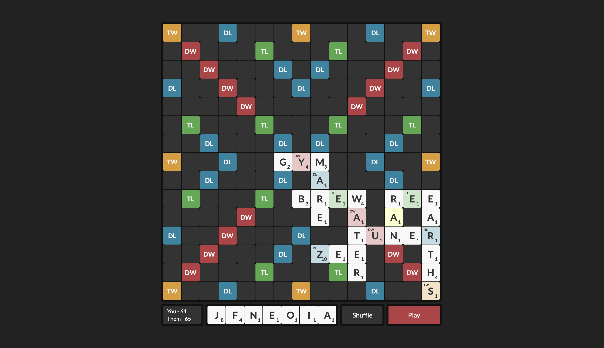

    <h1>Wordfeud</h1>
    
An online wordfeud website where you can play wordfeud with your friends.

    
<i>A preview of how the game looks</i>

## Overview

This is a wordfeud clone that you can spin up to play with friends. The frontend uses React and the backend is written in nodejs. The backend is not very secure so don't run this in any production environment. Routing is managed by [traefik](https://traefik.io/).

## How to play

When an user visits the website for the first time, an account will be automatically created for them. When going into a game link that nobody has visited previously the game will register that account as the player specified in the url. Otherwise the game will enter spectate mode.

When you visit the website you need to provide a gameid and player query param. Gameid can be any string of ascii letters and player can be one of 1 or 2. If there is no game associated with the provided gameid a game will be created automatically.

## Running locally

The entire project can be run with [docker compose](https://docs.docker.com/compose/). Just run `docker compose up` in the root of the project. You need to set the PORT env variable to the port you want the server to use.

## Not implemented

- There is no way for a game to end, players will have to decide that themselves
- You can't set a name for the username you're logged in as
- No way to see previously played words
- No way to see the score of a word before playing it
